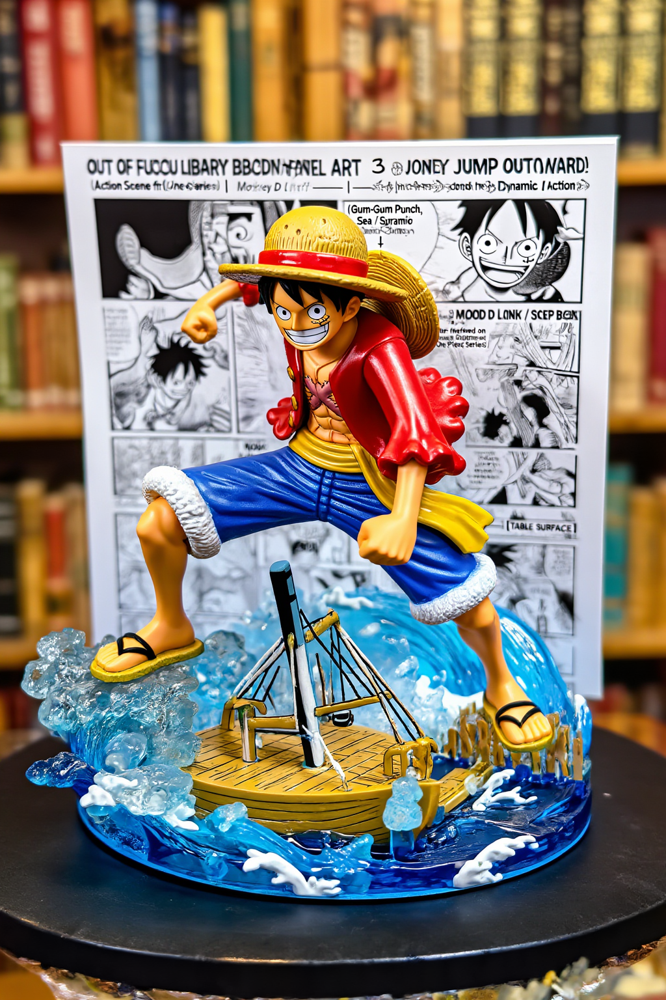
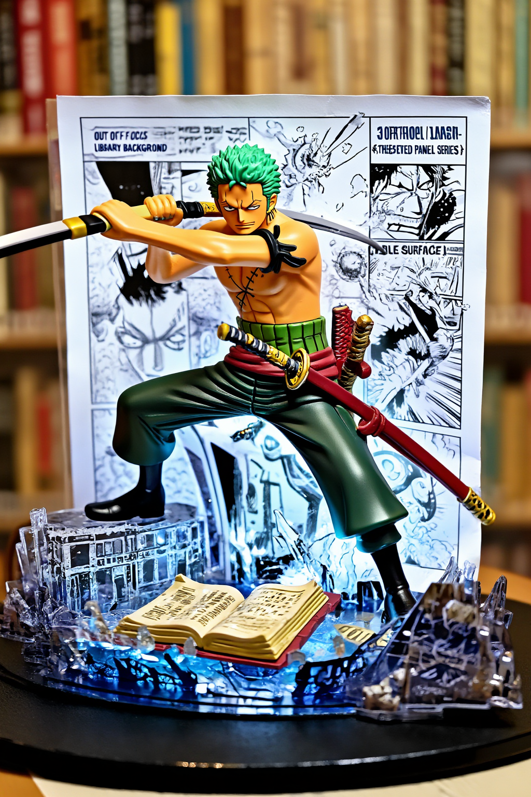
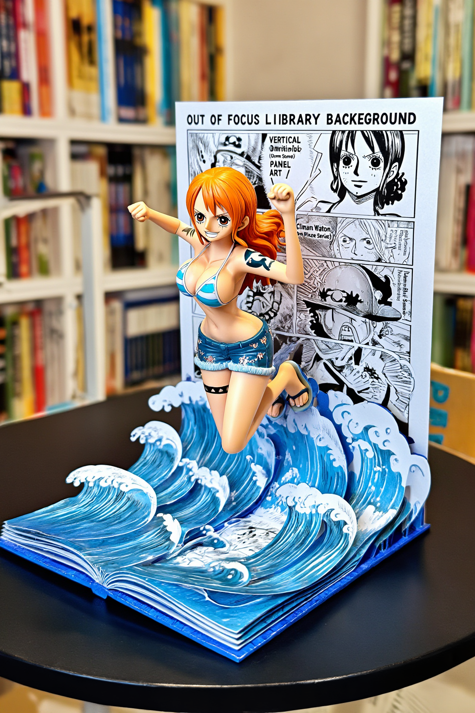
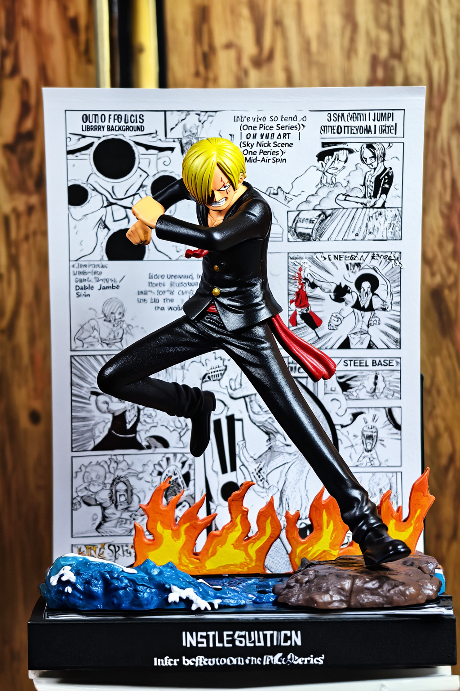
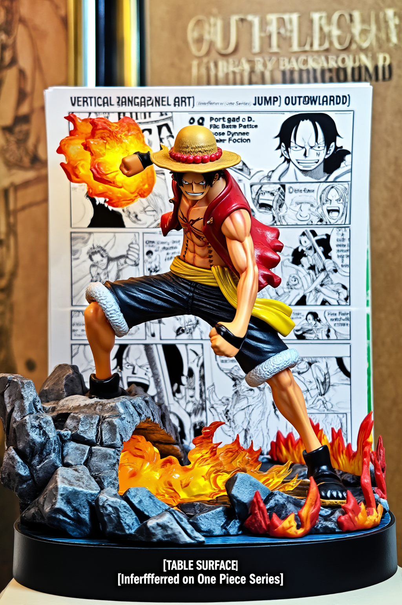
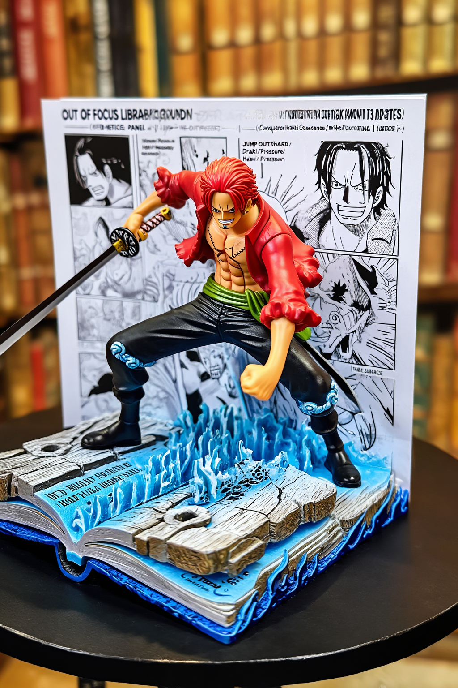

```yaml
pubDate: 2026-03-04
coverIndex: 1
authors: ["shiyuh"]
draft: true
description: 海贼王立体书风格生图提示词实战
```

# 01｜探索 AI 生成艺术：以《海贼王》为灵感的 Pop-Up Book 风格提示词指南

这篇是系列第 1 轮实战：把《海贼王》角色放进 **Pop-Up Book（立体书）** 场景，用 `z-image` 在 ComfyUI 上稳定批量生成高质感图像。

---

## 0. V2 推荐（更稳定）：严格结构模板

```text
manga <Monkey D. Luffy>
[ OUT OF FOCUS LIBRARY BACKGROUND ]

[ VERTICAL MANGA PANEL ART ]
[ (Action Scene from One Piece Series) ] <--- Backplate
|
[ 3D Monkey D. Luffy JUMPING OUTWARD ] <--- Hero Object
[ (Mid-Air Pose, Dynamic Action) ]
|
[ OPEN BOOK / WOODEN DECK / SEA SPRAY BASE ] <--- Ground
[ (Infer based on One Piece Series) ]

[ TABLE SURFACE ]

INSTRUCTION:
1. Render as a high-end "Pop-Up Book" aesthetic.
2. The Background is flat paper. The Character is full 3D plastic/resin.
3. Lighting: "Toy Photography" style (Softbox, vibrant colors).
```

**Negative Prompt（建议）**

```text
blurry, low quality, extra fingers, deformed hands, text watermark, collage, multi-panel, split screen, four-grid
```

**实测参数**

```bash
WIDTH=1024 HEIGHT=1536
STEPS=25 CFG=4.0
SAMPLER_NAME=euler
SCHEDULER=simple
DENOISE=1.0
```

### V2 示例图（单人单张）





---

## 1. 这套风格为什么适合海贼王？

- 海上冒险题材天然有强场景层次（船体、海浪、火花、木甲板）。
- 角色服饰和动作辨识度高，适合立体书“跳出页面”的视觉语言。
- 热血战斗与高饱和配色和玩具摄影灯光非常契合。

---

## 2. 提示词结构公式

\[
\text{Prompt} = \text{角色与动作} + \text{立体书空间结构} + \text{材质对比} + \text{摄影灯光} + \text{色彩与镜头}
\]

---

## 3. 模板实战（6 组）

### 模板 1：路飞（封面推荐）

**Prompt**

```text
manga <Monkey D. Luffy> [ OUT OF FOCUS LIBRARY BACKGROUND ] [ VERTICAL MANGA PANEL ART ] [ (Action Scene from One Piece Series) ] | [ 3D Monkey D. Luffy JUMPING OUTWARD ] [ (Gum-Gum Punch, Dynamic Action) ] | [ OPEN BOOK / WOODEN DECK / SEA SPRAY BASE ] [ (Infer based on One Piece Series) ] [ TABLE SURFACE ] INSTRUCTION: Render as a high-end Pop-Up Book aesthetic. The Background is flat paper. The Character is full 3D plastic/resin. Lighting: Toy Photography style (Softbox, vibrant colors).
```

**Negative Prompt**

```text
blurry, low quality, extra fingers, deformed hands, text watermark, collage, multi-panel, split screen, four-grid
```


---

### 模板 2：索隆（三刀流）

**Prompt**

```text
manga <Roronoa Zoro> [ OUT OF FOCUS LIBRARY BACKGROUND ] [ VERTICAL MANGA PANEL ART ] [ (Sword Duel Scene from One Piece Series) ] | [ 3D Roronoa Zoro JUMPING OUTWARD ] [ (Three-Sword Style Slash, Dynamic Action) ] | [ OPEN BOOK / BROKEN PLANK / SPARK BASE ] [ (Infer based on One Piece Series) ] [ TABLE SURFACE ] INSTRUCTION: Render as a high-end Pop-Up Book aesthetic. The Background is flat paper. The Character is full 3D plastic/resin. Lighting: Toy Photography style (Softbox, vibrant colors).
```

**Negative Prompt**

```text
blurry, low quality, extra fingers, deformed hands, text watermark, collage, multi-panel, split screen, four-grid
```


---

### 模板 3：娜美（天候棒）

**Prompt**

```text
manga <Nami> [ OUT OF FOCUS LIBRARY BACKGROUND ] [ VERTICAL MANGA PANEL ART ] [ (Storm Scene from One Piece Series) ] | [ 3D Nami JUMPING OUTWARD ] [ (Climate Baton, Lightning Pose) ] | [ OPEN BOOK / OCEAN WAVE / THUNDER BASE ] [ (Infer based on One Piece Series) ] [ TABLE SURFACE ] INSTRUCTION: Render as a high-end Pop-Up Book aesthetic. The Background is flat paper. The Character is full 3D plastic/resin. Lighting: Toy Photography style (Softbox, vibrant colors).
```

**Negative Prompt**

```text
blurry, low quality, extra fingers, deformed hands, text watermark, collage, multi-panel, split screen, four-grid
```


---

### 模板 4：山治（恶魔风脚）

**Prompt**

```text
manga <Sanji> [ OUT OF FOCUS LIBRARY BACKGROUND ] [ VERTICAL MANGA PANEL ART ] [ (Sky Kick Scene from One Piece Series) ] | [ 3D Sanji JUMPING OUTWARD ] [ (Diable Jambe Kick, Mid-Air Spin) ] | [ OPEN BOOK / FIRE SPARK / STEEL BASE ] [ (Infer based on One Piece Series) ] [ TABLE SURFACE ] INSTRUCTION: Render as a high-end Pop-Up Book aesthetic. The Background is flat paper. The Character is full 3D plastic/resin. Lighting: Toy Photography style (Softbox, vibrant colors).
```

**Negative Prompt**

```text
blurry, low quality, extra fingers, deformed hands, text watermark, collage, multi-panel, split screen, four-grid
```



---

### 模板 5：艾斯（火拳）

**Prompt**

```text
manga <Portgas D. Ace> [ OUT OF FOCUS LIBRARY BACKGROUND ] [ VERTICAL MANGA PANEL ART ] [ (Flame Battle Scene from One Piece Series) ] | [ 3D Portgas D. Ace JUMPING OUTWARD ] [ (Fire Fist Pose, Dynamic Action) ] | [ OPEN BOOK / BURNING EMBER / ROCK BASE ] [ (Infer based on One Piece Series) ] [ TABLE SURFACE ] INSTRUCTION: Render as a high-end Pop-Up Book aesthetic. The Background is flat paper. The Character is full 3D plastic/resin. Lighting: Toy Photography style (Softbox, vibrant colors).
```

**Negative Prompt**

```text
blurry, low quality, extra fingers, deformed hands, text watermark, collage, multi-panel, split screen, four-grid
```



---

### 模板 6：香克斯（霸王色）

**Prompt**

```text
manga <Red-Haired Shanks> [ OUT OF FOCUS LIBRARY BACKGROUND ] [ VERTICAL MANGA PANEL ART ] [ (Conqueror Haki Scene from One Piece Series) ] | [ 3D Red-Haired Shanks JUMPING OUTWARD ] [ (Sword Draw, Haki Pressure) ] | [ OPEN BOOK / CRACKED WOOD / WAVE BASE ] [ (Infer based on One Piece Series) ] [ TABLE SURFACE ] INSTRUCTION: Render as a high-end Pop-Up Book aesthetic. The Background is flat paper. The Character is full 3D plastic/resin. Lighting: Toy Photography style (Softbox, vibrant colors).
```

**Negative Prompt**

```text
blurry, low quality, extra fingers, deformed hands, text watermark, collage, multi-panel, split screen, four-grid
```



---

## 4. 共绩 ComfyUI 调用方式（本次实战）

```bash
INSECURE_TLS=1 \
COMFY_BASE_URL="https://deployment-452-ejp7x8hs-8188.550w.link" \
PROMPT="<your_prompt>" \
NEGATIVE_PROMPT="<your_negative_prompt>" \
OUTPUT="outputs/onepiece_popbook_v2/template_01.png" \
python3 "测试comfyui_副本/demo/comfyui-zimage-demo/generate.py"
```

---

## 5. 结果复盘与优化建议

- 最稳成图：路飞、索隆、艾斯（动作和能量元素明显）。
- 后续优化：可固定 `seed` 做角色词 A/B；可增加镜头词（如 `16mm ultra-wide`）。
- 扩展方向：草帽团群像页、四皇主题页、9:16 封面特化版。
