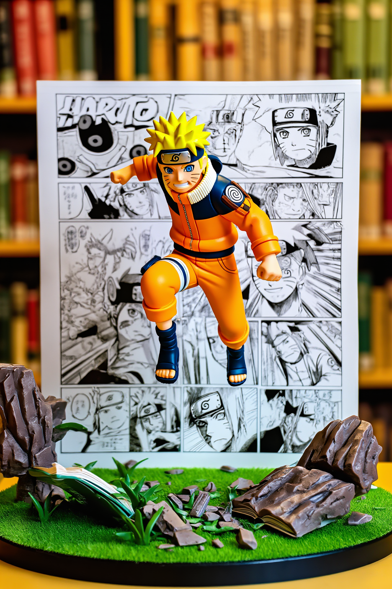
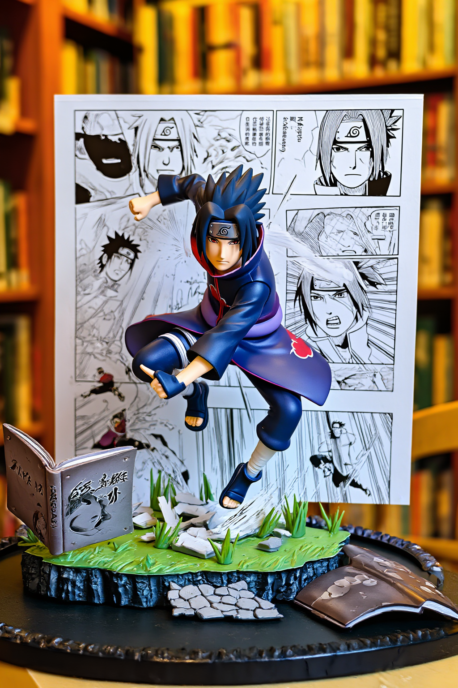
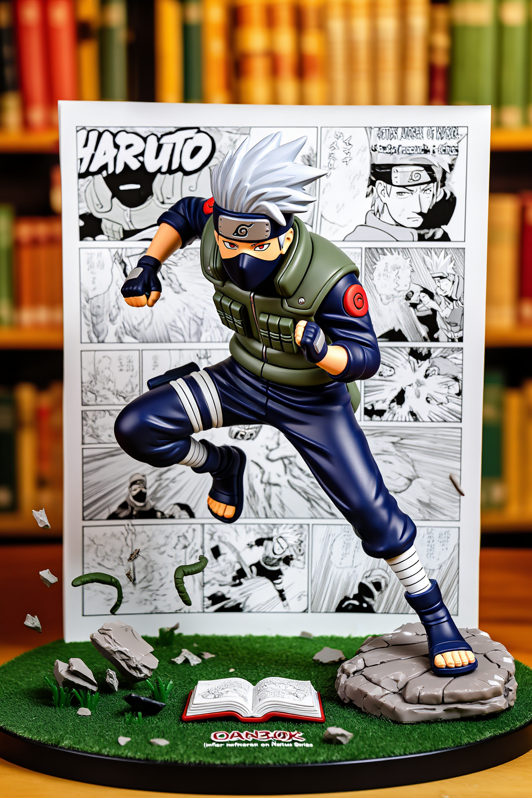
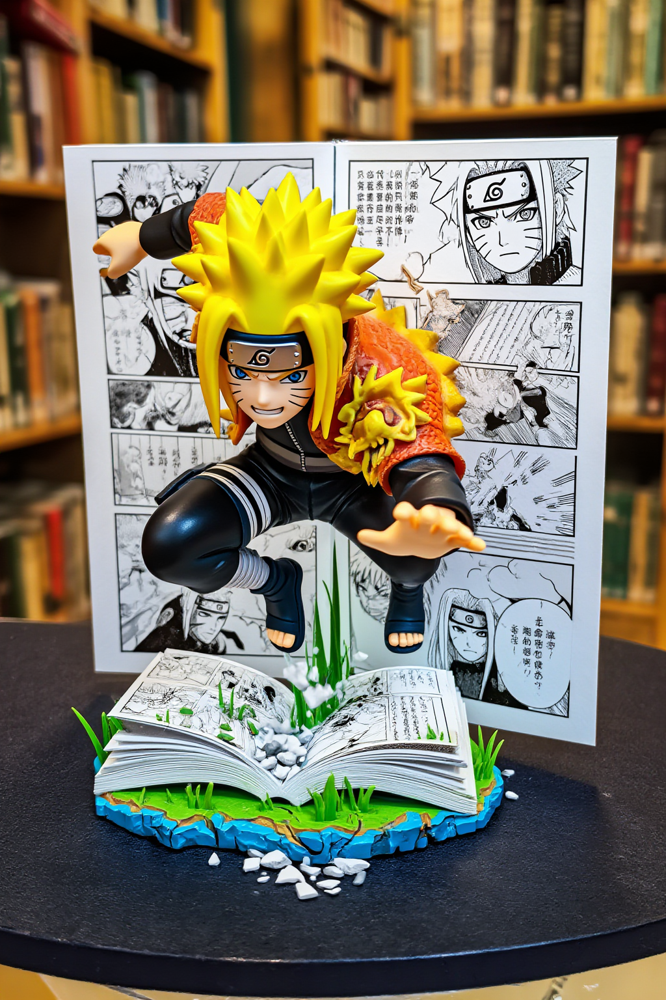
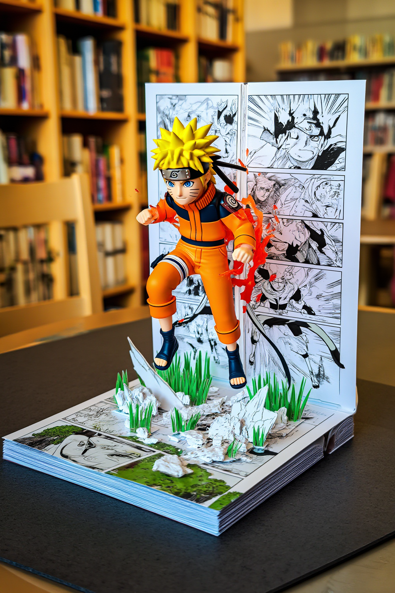
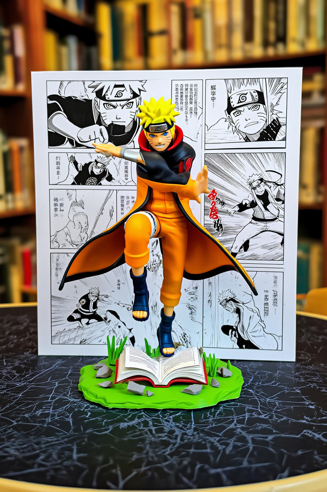

```yaml
pubDate: 2026-03-04
coverIndex: 1
authors: ["shiyuh"]
draft: true
description: 火影立体书风格提示词实战指南
```

# 探索 AI 生成艺术：以《火影忍者》为灵感的 Pop-Up Book 风格提示词指南

大家好，这篇是一次完整实战：把《火影忍者》角色放进 **Pop-Up Book（立体书）** 场景，用 `z-image` 在 ComfyUI 上批量生成高质感图像，并沉淀成可复用提示词模板。

本文包含：

- 可直接复用的提示词结构公式
- 5 组英文 Prompt + Negative Prompt
- 基于共绩算力 ComfyUI 的批量出图结果（已插图）

---

## 0. V2 推荐（更稳定）：严格结构模板

这次复盘后发现：对于 `z_image_bf16`，**结构化提示词比“堆风格词”更稳定**。  
推荐优先用这版（单人单张，只替换人物名）。

```text
manga <Uzumaki Naruto>
[ OUT OF FOCUS LIBRARY BACKGROUND ]

[ VERTICAL MANGA PANEL ART ]
[ (Action Scene from Naruto Series) ] <--- Backplate
|
[ 3D Uzumaki Naruto JUMPING OUTWARD ] <--- Hero Object
[ (Mid-Air Pose, Dynamic Action) ]
|
[ OPEN BOOK / GRASS / DEBRIS BASE ] <--- Ground
[ (Infer based on Naruto Series) ]

[ TABLE SURFACE ]

INSTRUCTION:
1. Render as a high-end "Pop-Up Book" aesthetic.
2. The Background is flat paper. The Character is full 3D plastic/resin.
3. Lighting: "Toy Photography" style (Softbox, vibrant colors).
```

**Negative Prompt（建议）**

```text
blurry, low quality, extra fingers, deformed hands, text watermark, collage, multi-panel, split screen, four-grid
```

**这版实测参数（更接近你网页端工作流）**

```bash
WIDTH=1024 HEIGHT=1536
STEPS=25 CFG=4.0
SAMPLER_NAME=euler
SCHEDULER=simple
DENOISE=1.0
```

### V2 示例图（单人单张）





---

## 1. 这套风格为什么有效？

这类图最关键是“材质对比”：

- **背景层**：扁平纸张漫画面板（flat paper）
- **主体层**：3D 塑料/树脂感角色（glossy resin figure）
- **摄影层**：玩具摄影灯光（softbox + rim light + shallow DOF）

直观效果是：角色像从书页里“跳出来”，同时保留动漫叙事和商品级质感。

---

## 2. 提示词结构公式（建议收藏）

可以按下面的公式拼装：

\[
\text{Prompt} = \text{角色与动作} + \text{立体书空间结构} + \text{材质对比} + \text{摄影灯光} + \text{色彩与镜头}
\]

我常用的骨架：

```text
[Character + pose], pop-up book diorama, 3D glossy resin figure emerging from page,
flat paper vertical manga panel backplate, blurred library shelves in background,
open book base with grass + debris, toy photography style, softbox studio lighting,
vibrant saturated anime colors, cinematic rim light, shallow depth of field, high detail
```

推荐通用 Negative Prompt：

```text
blurry, ugly, bad anatomy, deformed hands, extra fingers, low quality, watermark, text
```

---

## 3. 模板实战（5 组）

> 出图参数参考：`960x1280`、`steps=20`、竖构图风格。  
> 目录：`images/naruto_popbook_v2/`

### 模板 1：经典 Rasengan 跳跃（封面推荐）

**Prompt**

```text
High-end pop-up book diorama of Uzumaki Naruto, ultra-detailed 3D plastic resin action figure, dynamic mid-air jump with spinning Rasengan, flat vertical manga panel background, blurred library shelves behind, open book base with grass and battle debris, toy photography style, softbox studio light, vibrant saturated anime colors, cinematic rim light, shallow depth of field, masterpiece
```

**Negative Prompt**

```text
blurry, ugly, bad anatomy, deformed hands, extra fingers, low quality, watermark, text
```


---

### 模板 2：仙人模式（Sage Mode）

**Prompt**

```text
Premium pop-up book style scene of Naruto in Sage Mode, frog eyes, glowing green markings, natural energy aura, 3D resin toy figure leaping outward from page, flat paper manga battle panel, out-of-focus library background, open book base with rocks and grass, vibrant color grading, toy photography, soft dramatic lighting, high detail
```

**Negative Prompt**

```text
blurry, ugly, bad anatomy, deformed hands, extra fingers, low quality, watermark, text
```



---

### 模板 3：九尾查克拉模式（Kurama Mode）

**Prompt**

```text
Luxury pop-up book artwork, Naruto in Kurama chakra mode, glowing orange aura and chakra tails, aggressive dynamic pose mid-air, 3D glossy figure emerging from flat paper manga panel, blurred library backdrop, open book base, debris and chakra sparks, cinematic toy photography, rich contrast, vivid colors, shallow depth
```

**Negative Prompt**

```text
blurry, ugly, bad anatomy, deformed hands, extra fingers, low quality, watermark, text
```



---

### 模板 4：Boruto 时代火影 Naruto

**Prompt**

```text
High-quality pop-up book diorama of adult Naruto from Boruto era, Hokage cloak, wise determined expression, dynamic jump with Rasengan variant, 3D collectible resin style, flat paper vertical manga panel backplate, blurred bookshelves, open manga book base with village debris, toy-photography softbox lighting, vibrant colors, premium detail
```

**Negative Prompt**

```text
blurry, ugly, bad anatomy, deformed hands, extra fingers, low quality, watermark, text
```



---

### 模板 5：Sasuke 对照版（写轮眼）

**Prompt**

```text
High-end pop-up book scene of Uchiha Sasuke, activated Sharingan, dynamic sword pose in mid-air, black cloak flowing, 3D glossy resin toy style, flat paper manga backplate showing rivalry battle, out-of-focus library background, open book base with scorched grass and chidori sparks, cinematic toy photography, strong rim light, vibrant reds and blues
```

**Negative Prompt**

```text
blurry, ugly, bad anatomy, deformed hands, extra fingers, low quality, watermark, text
```


---

## 4. 共绩 ComfyUI 调用方式（本次实战）

本次实际使用的 ComfyUI 地址：

`https://deployment-452-ejp7x8hs-8188.550w.link`

基线命令：

```bash
INSECURE_TLS=1 \
COMFY_BASE_URL="https://deployment-452-ejp7x8hs-8188.550w.link" \
PROMPT="<your_prompt>" \
NEGATIVE_PROMPT="<your_negative_prompt>" \
OUTPUT="outputs/naruto_popbook/template_01.png" \
python3 "测试comfyui_副本/demo/comfyui-zimage-demo/generate.py"
```

批量建议：

- 固定“风格核心词”（pop-up book + toy photography + material contrast）
- 每次只替换“角色/动作/模式词”
- 统一分辨率与步数，便于横向比较

---

## 5. 结果复盘与优化建议

- **最稳成图**：模板 1、模板 3（动作与能量元素强）
- **可继续优化**：
  - 增加“camera lens”描述（如 `16mm ultra-wide`）
  - 增加“paper texture”关键词权重，拉开 2D/3D 对比
  - 固定 seed 做 A/B 对比（只改角色词）

如果你想继续扩展，我建议下一组做：

- 卡卡西（雷切）
- 鸣人 x 佐助双人对决
- 9:16 竖屏封面版（短视频平台适配）

